# <div align="center">Tasky App</div>

<div align="center">
  <p><strong>Smart. Efficient. Organized.</strong></p>
  <p>
    A high-performance task management solution built with Flutter and Clean Architecture.
    <br />
    Organize your daily life, filter tasks securely, and manage your profile with ease.
  </p>
</div>

<div align="center">

  
  
  
  
  

</div>

<br />

## 📸 Screenshots

<div align="center">

<h3>🚀 Onboarding Journey</h3>
  <table>
    <tr>
      <td align="center">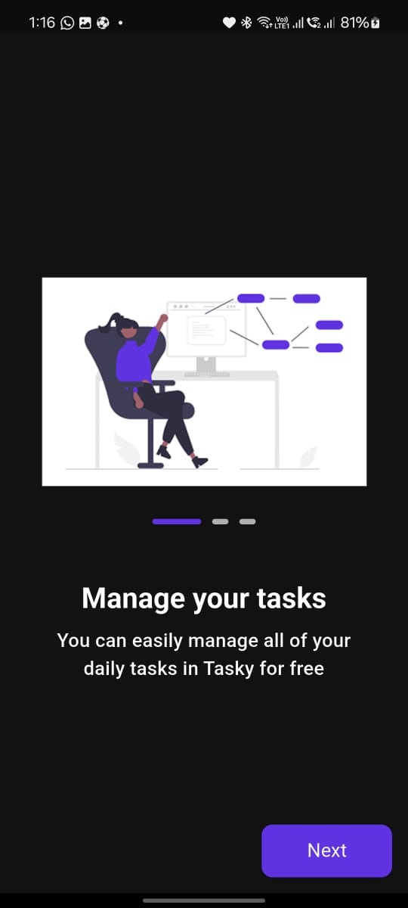<br /><b>Step 1</b></td>
      <td align="center">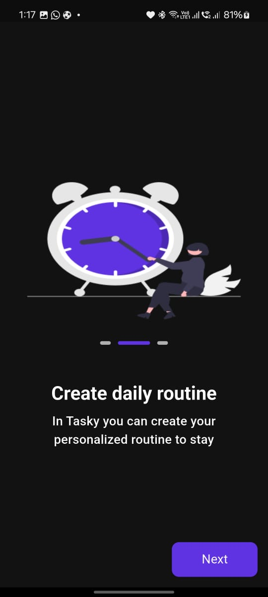<br /><b>Step 2</b></td>
      <td align="center">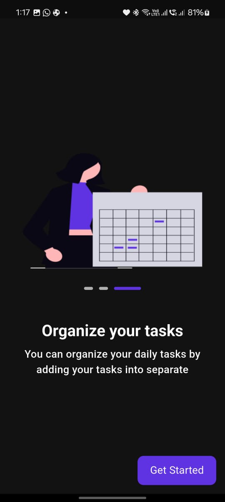<br /><b>Step 3</b></td>
    </tr>
  </table>

<h3>🔐 Authentication</h3>
  <table>
    <tr>
      <td align="center">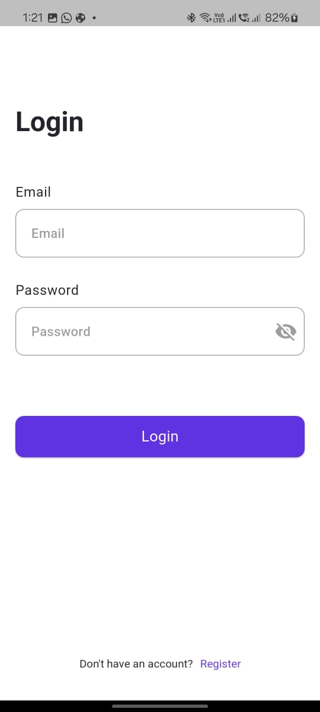<br /><b>Login</b></td>
      <td align="center">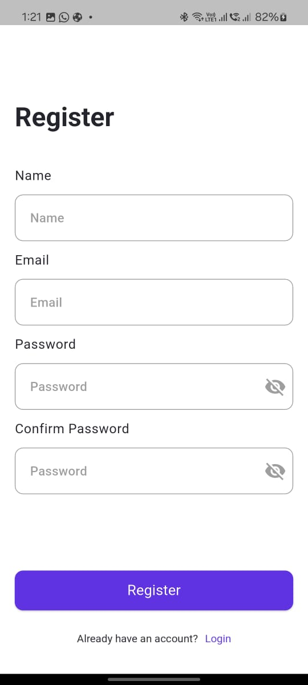<br /><b>Register</b></td>
      <td align="center">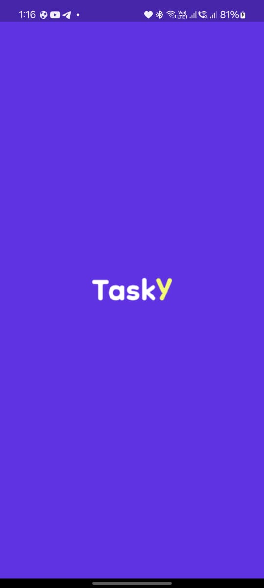<br /><b>Splash</b></td>
    </tr>
  </table>

<h3>🏠 Core Features</h3>
  <table>
    <tr>
      <td align="center">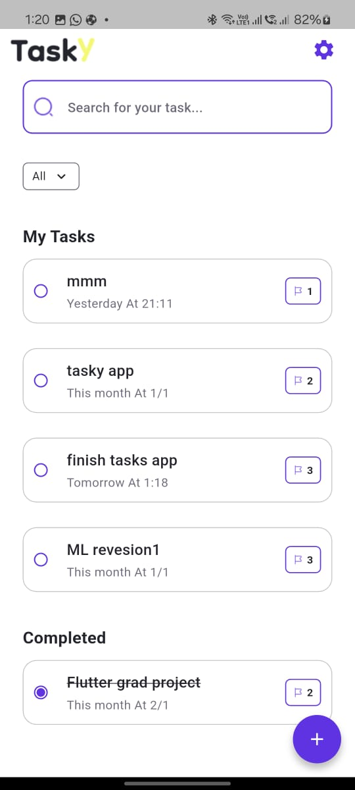<br /><b>Home (Light)</b></td>
      <td align="center">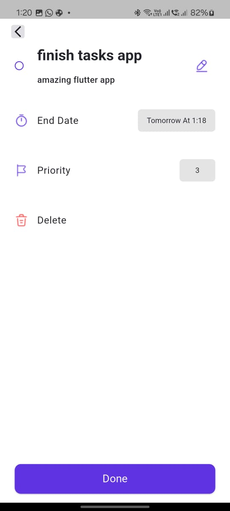<br /><b>Details</b></td>
      <td align="center">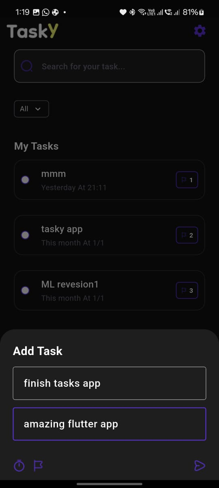<br /><b>Add Task (Dark)</b></td>
       <td align="center">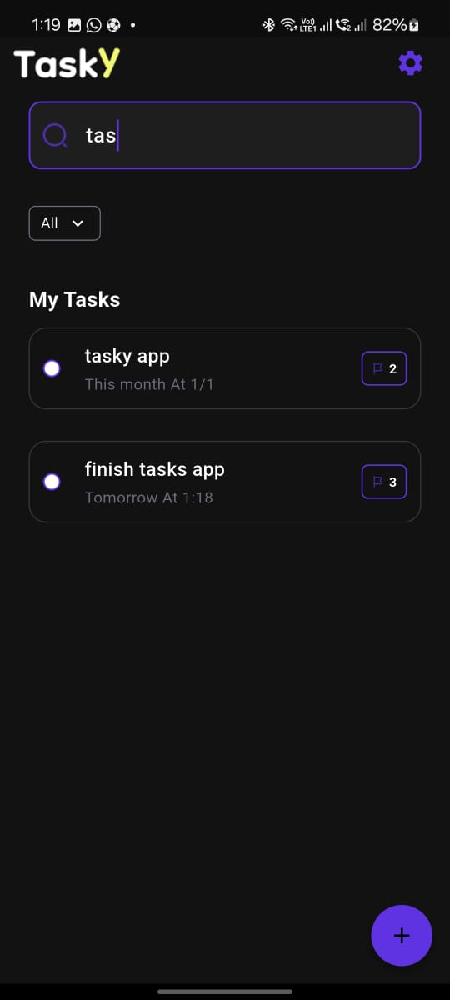<br /><b>Search</b></td>
    </tr>
  </table>

<h3>🌍 Localization & Themes</h3>
  <table>
    <tr>
      <td align="center">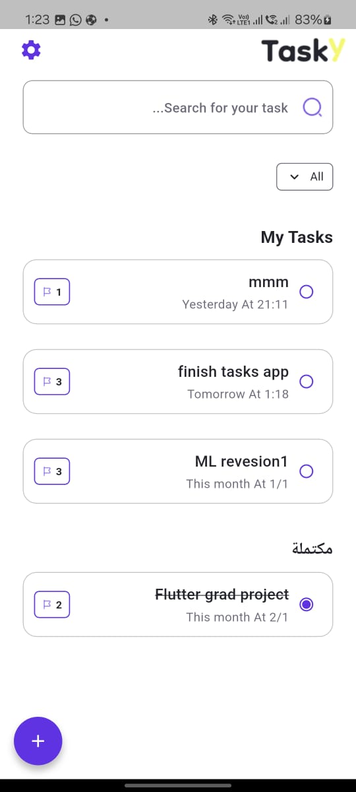<br /><b>Home (Arabic)</b></td>
      <td align="center">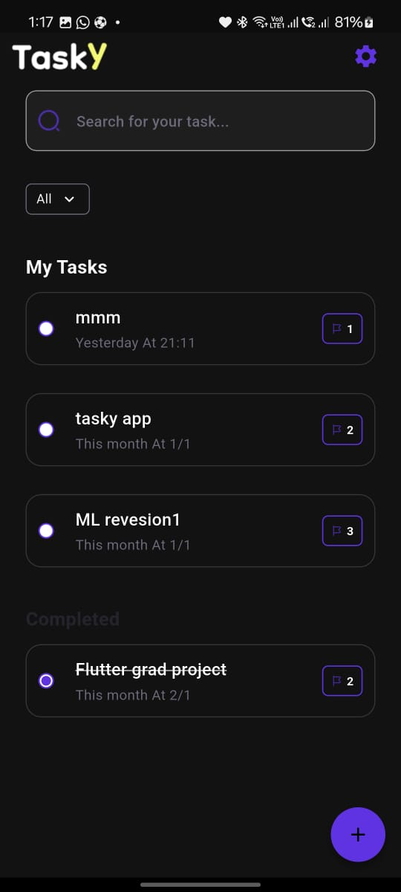<br /><b>Home (Dark)</b></td>
       <td align="center">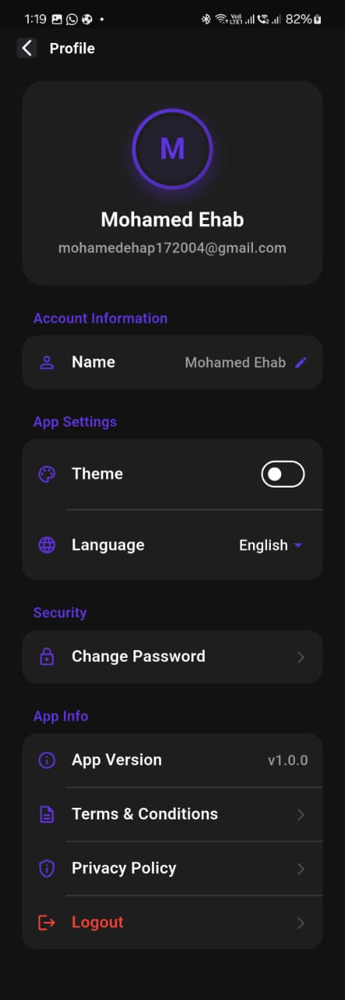<br /><b>Profile (Dark)</b></td>
    </tr>
  </table>
</div>

<br />

## ✨ Key Features

-   🔐 **Secure Authentication**: Robust Login, Signup, and Change Password functionality powered by Firebase Auth.
-   📋 **Comprehensive Task Management**: Create, Read, Update, and Delete tasks seamlessly.
-   🧠 **Smart Filtering**: Instantly filter tasks by Date (All, Today, Tomorrow, Next Week, etc.) and Status.
-   🔍 **Real-time Search**: Find specific tasks instantly with reactive search capabilities.
-   🌍 **Localization Support**: Fully localized for **English** (LTR) and **Arabic** (RTL).
-   📱 **Responsive Design**: Pixel-perfect UI across various screen sizes using `flutter_screenutil`.
-   💾 **Persistent Onboarding**: Smart onboarding flow that remembers returning users.
-   🎨 **Dark/Light Mode**: (Ready for implementation based on `ThemeCubit`).

## 🏗️ Architecture & Tech Stack

This project strictly adheres to **Clean Architecture** principals to ensure scalability, testability, and maintainability.

### Folder Structure
```bash
lib/
├── core/                   # Core utilities, DI, Routes, Theme, Wrappers
├── features/               # Feature-based modules
│   ├── auth/               # Authentication (Data, Domain, Presentation)
│   ├── home/               # Task Management (Data, Domain, Presentation)
│   ├── profile/            # User Profile (Data, Domain, Presentation)
│   └── splash/             # Splash & Onboarding Logic
└── main.dart               # Entry point
```

### Technologies Used
-   **State Management**: `flutter_bloc` (Cubit)
-   **Dependency Injection**: `get_it`
-   **Routing**: `go_router`
-   **UI Adaptation**: `flutter_screenutil`
-   **Comparisons**: `equatable`
-   **Localization**: `easy_localization`, `intl`
-   **Backend**: Firebase (Auth, Firestore)
-   **Animations**: `animate_do`

## 🚀 Installation & Setup

Follow these steps to get the app running locally.

### 1. Clone the Repository
```bash
git clone https://github.com/yourusername/tasky_app.git
cd tasky_app
```

### 2. Install Dependencies
```bash
flutter pub get
```

### 3. Setup Firebase & Secrets
> [!IMPORTANT]
> This project relies on Firebase. You must provide your own configuration files as they are ignored by git for security.

-   **Android**: Place `google-services.json` in `android/app/`.
-   **iOS**: Place `GoogleService-Info.plist` in `ios/Runner/`.

### 4. Run the App
```bash
flutter run
```

## 📞 Contact

For any inquiries or feedback, feel free to reach out:

-   **Name**: Mohamed Ehab
-   **Email**: mohamedehap172004@gmail.com

---

<div align="center">
  <sub>Built with Mohamed Ehab using Flutter</sub>
</div>
